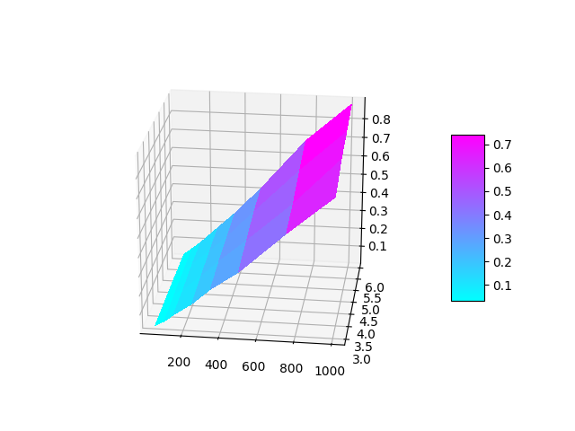
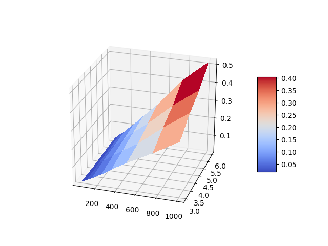

# Assigment 3
Implement Bellman Ford Algorithm and run it for a number of a number of inputs.
[1pt] Implementation: Github link
[1pt] Chart showing the running time vs input (vertices and edges) [Submit a pdf/picture]

## Solution
The algorithm code is in Bellman_Ford.py. It is available as a class which takes either an adjacency list or an edge list as input.

The Compute_Plot_Save.py runs the algorithm for random graphs generated using the custom generator in Random_Graph_Generator.py. This ensures a uniform weight distribution in the graph. The parameters of the graph like maximum weight, number of vertices and number of edges can be simply changed by modifying the constants in the code.

```
The main problem with the generator is that number of edges generated and comparisons make the runtime much larger for high number of edges. This creates a limitation in testing the time complexity of the algorithm. Had a sparse, large dataset been given, the tests could have been performed. I am still attaching  graph using data from a [paper](http://hdl.handle.net/1721.1/5263) I found on the internet. The computations were done on a IBM 370/168 computer at MIT in October 1975. So we can get an idea how the computations would be in current age computers.
```

## Dataset
The dataset is in the respective plotting files under the arrays X, Y and Z. To plot the data yourself, you need to do
```bash
pip install requirements.txt
```
to install all the required dependencies. After that run dj.py for Djikstra plot and bf.py for Bellman Ford plot. The plots obtained are interactive plot's and the view can be changed by clicking and dragging the graph.

X represents the number of nodes
Y represents the number of outgoing connections from each node for all node values
Z represents the runtime obtained in seconds

There are two files for two different algorithms - Djikstra's Algorithm and Bellman Ford Algorithm

## Djikstra's Algorithm


## Bellman Ford Algorithm

