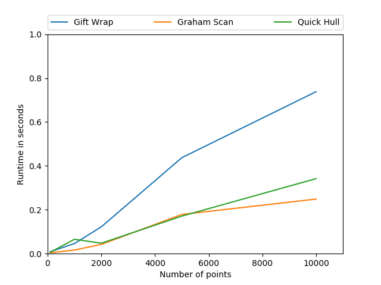

# Assignment 4
Implement the following algorithms for constructing the convex hull: [GitHub link]
[1.5 points] 1. Gift wrapping algorithm
[1.5 points] 2. Graham scan algorithm
[1.5 points] 3. Quick Hull

[1.5 points] Comparison chart between those two algorithms. [Pdf chart]
Take 5 test cases with number of points as (n = )100, 1000, 2000, 5000, 10000

## Solution
The algorithm code is in the files of the repository. It is available as classes which take points generated by the random case generator.
The plotter.py runs the algorithm for random points generated using the custom generator. This ensures a uniform point distribution in the space.

## Dataset
The data generated by the algorithms is in the data folder. To plot the data yourself, you need to do
```bash
pip install requirements.txt
```
to install all the required dependencies. Then run plotter.py for plot generation and data logging. The plots obtained are interactive plot's and the view can be changed by clicking and dragging the graph.

There are two files - points.csv containing the latest random points generated and time.csv which contains the timer data for each algorithm and its test cases.

## Runtime Plot

